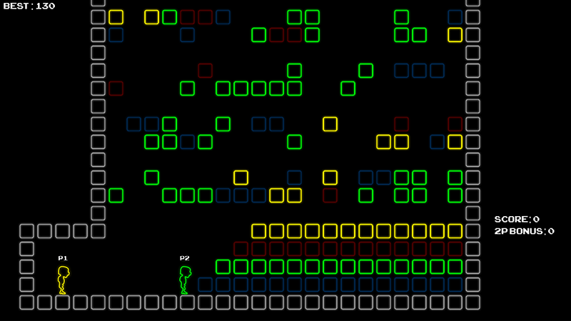

# Bursting with Colour

A cooperative 2D platformer where players swap colours of blocks to climb as
high as they possibly can. Built in two days, this is our submission to the
2014 Global Game Jam. For more information, including downloadable builds for
Mac and PC, visit our [submission page](http://globalgamejam.org/2014/games/bursting-colour).

The game was built in two days using Unity 4.3. We used Unity's new 2D system
for physics and sprites. The level is randomly generated. As you may expect
from a game jam submission, the code is messy in parts, but it should be mostly
readable.

## Controls

The game is played with two Xbox 360 controllers. On Windows this should work
seamlessly, while on Mac you must first install a
[driver](http://tattiebogle.net/index.php/ProjectRoot/Xbox360Controller/OsxDriver).
The left joystick controls moving and jumping. The four coloured buttons (A, B,
X, Y) switch the colours of blocks in the level.

## Credits

- Brad Keys
- Matthew Miner
- Brent Mitchell
